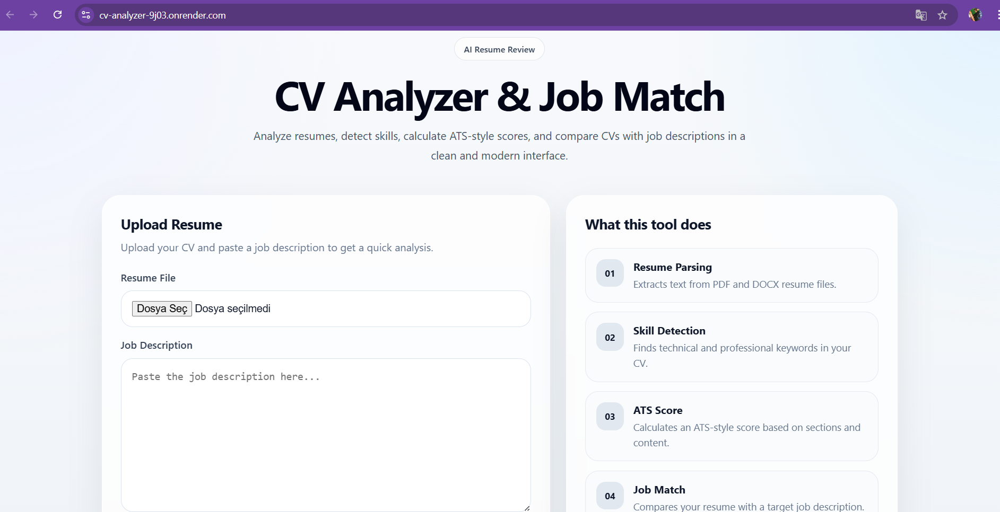

# 📄 CV Analyzer

An AI-powered CV analysis tool that evaluates resumes, calculates ATS compatibility scores, and matches candidates with job descriptions.

Built with **Flask** and designed to help job seekers optimize their resumes for Applicant Tracking Systems (ATS).

---

## 🚀 Features

- ✅ ATS Resume Score Calculation
- ✅ Resume & Job Description Matching
- ✅ Keyword Analysis
- ✅ Missing Skills Detection
- ✅ Candidate Profile Evaluation
- ✅ Simple and user-friendly interface

## 🛠️ Technologies

- Python
- Flask
- HTML5
- CSS3
- JavaScript
- NLP (Natural Language Processing)
- Machine Learning concepts

---

## 📂 Project Structure

## Preview

